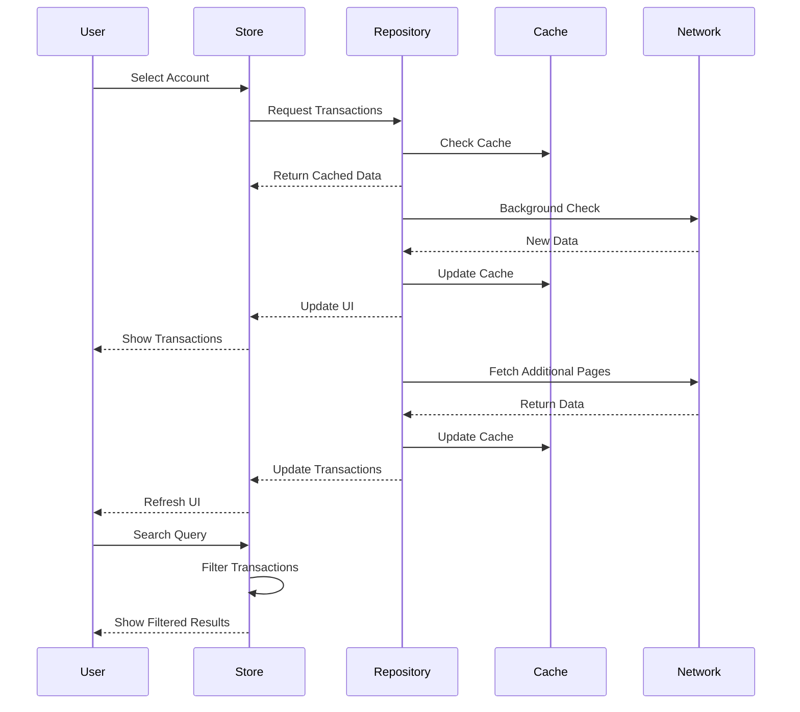

# Bank Transactions Search Application

This application implements an efficient and responsive transaction search system with background synchronization and caching mechanisms.

## Architecture Overview

The application follows a repository pattern with two main components:

### TransactionRepository

Handles all data-related operations including:

* In-memory caching
* Network requests
* Background updates
* Data synchronization

### TransactionStore

Manages the UI state and provides:

* Transaction filtering
* Search functionality
* Account state management

## Data Flow

1. **Initial Account Selection**  
   * User selects an account  
   * Store triggers data synchronization  
   * Repository checks local cache

2. **Data Retrieval Process**  
   * Repository fetches first page immediately
   * Data is stored in SQLite database
   * Memory cache is updated
   * Background fetch of additional pages begins
   * UI is updated with available data

3. **Background Updates**  
   * Repository periodically checks for new transactions  
   * Updates are fetched without interrupting the UI  
   * Cache is updated with new data  
   * UI is refreshed with latest transactions

## Sequence Diagram



## Search Implementation

### Local Search Features

* Real-time filtering of transactions
* Case-insensitive search
* Searches across multiple transaction fields
* Results update instantly as user types

### State Management

The search functionality maintains several states:

* Initial state: Empty array of transactions
* Filtered state: Subset of transactions matching search criteria
* Loading state: Indicates ongoing data fetch
* Error state: Handles and displays error scenarios

## Caching Strategy

### Memory Cache

* Stores recently fetched transactions
* Reduces network requests
* Improves application responsiveness
* Automatically cleans old data

### Cache Invalidation

* Time-based invalidation (5-minute interval)
* Account change triggers
* Manual refresh option
* Background sync validation

## Usage Example

```typescript
// Initialize store
const transactionStore = new TransactionStore();

// Select account
await transactionStore.setAccount("account123");

// Search transactions
transactionStore.searchQuery = "payment";
// Filtered transactions are automatically updated
```

## Technical Details

### Data Types

```typescript
interface Transaction {
  id: string;
  amount: number;
  description: string;
  date: Date;
  // ... other fields
}

interface DataState<T> {
  content: T | null;
  loading: boolean;
  error: Error | null;
}
```

### Key Methods

* `getTransactions`: Fetches transactions with optional force reload
* `checkForUpdates`: Performs background synchronization
* `syncTransactions`: Coordinates data updates
* `cleanOldTransactions`: Manages cache cleanup

## Best Practices

1. **Data Management**  
   * Always validate cached data  
   * Implement proper error boundaries  
   * Handle edge cases gracefully  
   * Maintain data consistency

2. **UI Responsiveness**  
   * Never block the main thread  
   * Provide loading indicators  
   * Implement smooth transitions  
   * Handle background updates seamlessly

